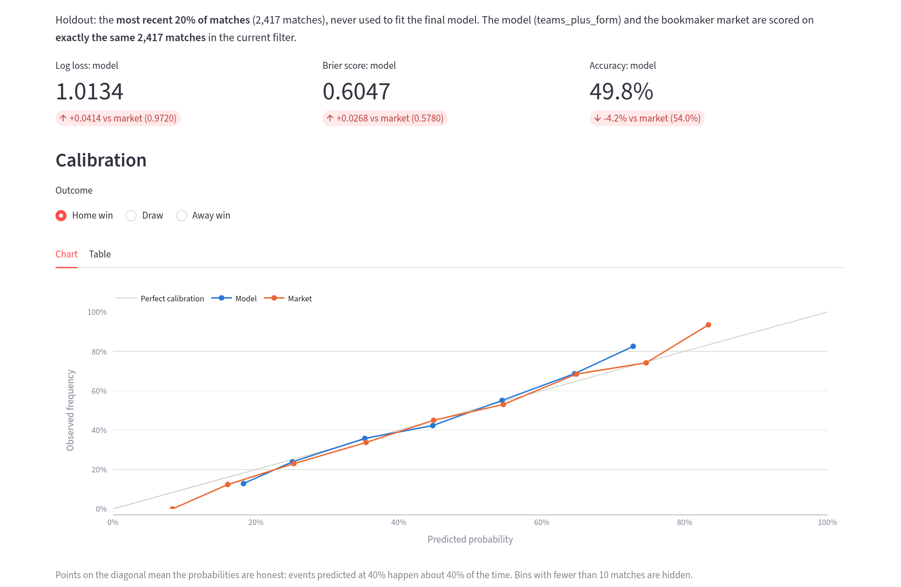
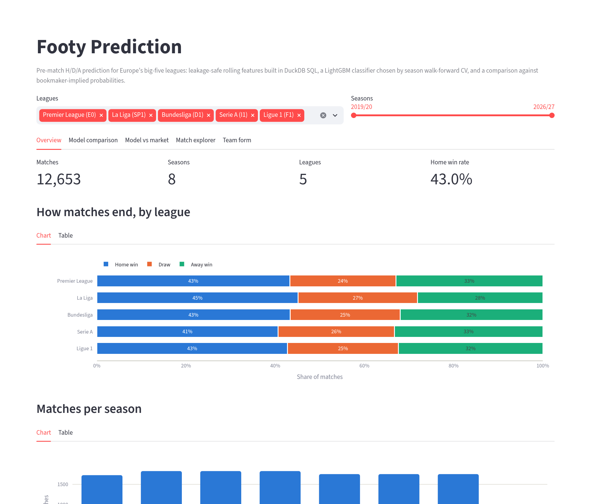
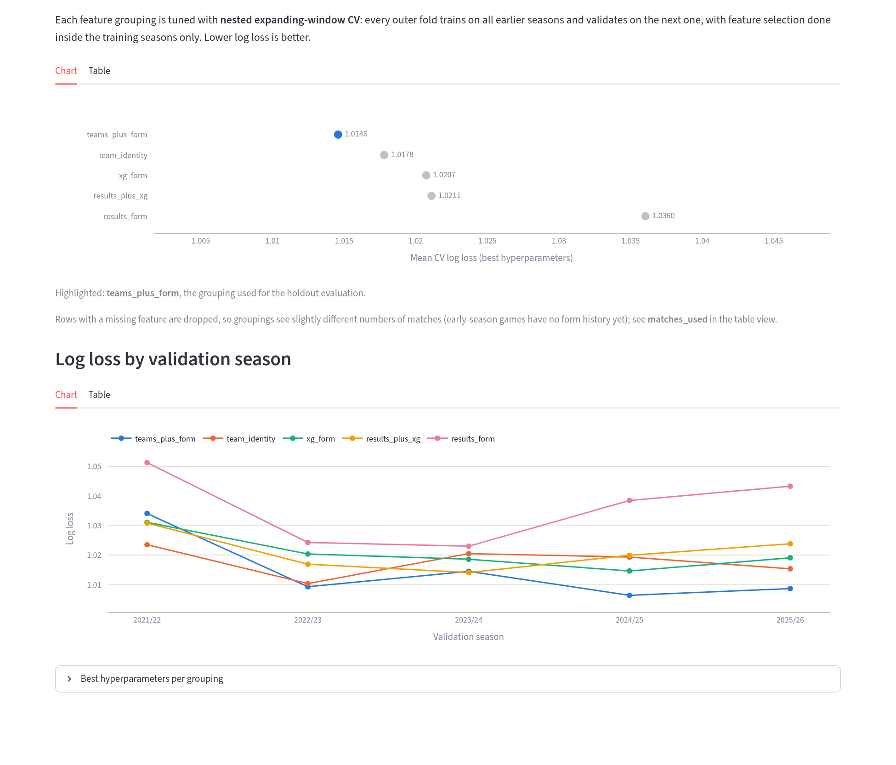

# ⚽ footy-prediction

**Can a machine-learning model predict football results better than the bookmakers?**

This project predicts the outcome of a football match (**home win, draw or away win**) using only
information available *before kickoff*. It covers Europe's big-five leagues (Premier League,
La Liga, Bundesliga, Serie A, Ligue 1) from 2019/20 onwards. The bookmakers' own odds are the
benchmark. The model never sees the odds: it learns only from **football information** (team
identity, results form and expected goals, xG), and the question is how close that gets to the
market.

<!-- RESULTS-START -->
## Results

**Football data alone closes about 60% of the gap between a naive guess and the bookmakers, but the
market stays ahead.** Holdout: the most recent 20% of matches (2,417 games with complete
features, Feb 2025 to Sep 2026, all five leagues), with every model scored on exactly the same
matches:

| | Log loss ↓ | Accuracy ↑ |
|---|---|---|
| Naive baseline (historical H/D/A frequencies) | 1.0727 | 43.2% (always "home win") |
| **LightGBM on football data** (`teams_plus_form`) | **1.0134** | **49.8%** |
| Bookmaker market (average pre-match odds, margin removed; benchmark only) | 0.9720 | 54.0% |

What the feature-grouping comparison (walk-forward CV, mean log loss over 5 seasons) shows:

| Grouping | CV log loss | Takeaway |
|---|---|---|
| `teams_plus_form` | **1.0146** | Best: team identity + points difference + away xG |
| `team_identity` | 1.0178 | *Who* is playing already explains most of it |
| `xg_form` | 1.0207 | Chance quality (xG) beats results as a form signal |
| `results_plus_xg` | 1.0211 | Adding results to xG adds nothing |
| `results_form` | 1.0360 | Recent results alone are the noisiest signal |

- **xG is a better form signal than results.** Five-match results are dominated by luck; xG
  created and conceded measures performance more reliably.
- **Long-run team strength matters most**, and recent form adds only a little on top.
- **The market remains clearly better.** It prices information the model doesn't see: injuries,
  line-ups, transfers and longer-term ratings.

Explore it in the app: calibration curves, per-league results and every holdout match.
<!-- RESULTS-END -->



## What's in the project

1. **Data**: match results, match stats and average pre-match bookmaker odds from
   [football-data.co.uk](https://www.football-data.co.uk), plus per-match expected goals from
   Understat, for about 12,600 matches.
2. **Leakage-safe features (DuckDB SQL)**: rolling form over each team's previous 5 and 10
   matches (points, goals, shots, corners, fouls, rest days), home-only and away-only form, and
   rolling xG created and conceded. Bookmaker odds are converted to margin-free probabilities and
   kept **only as the benchmark**. Every rolling window ends *one match before* the match being
   predicted, so a result never leaks into its own features.
3. **Model (LightGBM)**: a multiclass classifier comparing five non-market feature groupings
   (team identity, results form, xG form, and combinations), tuned with nested, expanding-window
   cross-validation by season. Each fold trains on all earlier seasons and validates on the next
   one, with forward feature selection done inside the training seasons only.
4. **Evaluation**: log loss, Brier score and accuracy on the chronologically last 20% of matches,
   scored against the bookmaker probabilities on exactly the same matches.
5. **Interactive app (Streamlit)**: explore the data, the CV comparison, calibration, and
   individual match predictions.

## Quick start: run the app from GitHub

Requires Python 3.10+ and git.

```bash
git clone https://github.com/elliot-gautier-129/footy-prediction.git
cd footy-prediction
python -m venv .venv
source .venv/bin/activate          # Windows: .venv\Scripts\activate
pip install -r requirements.txt    # also installs this project's package (pip install -e .)
streamlit run app/streamlit_app.py
```

Streamlit opens the app at <http://localhost:8501>. The repository already includes the
processed data and saved model results, so the app works straight after cloning; there's no need
to download data or retrain.

### The app

| Tab | What it shows |
|---|---|
| **Overview** | Matches per season, and how often each league ends in a home win, draw or away win |
| **Model comparison** | Cross-validated log loss of each feature grouping, per validation season |
| **Model vs market** | Holdout log loss / Brier / accuracy vs the bookmakers, calibration curves, cumulative advantage over time, per-league comparison |
| **Match explorer** | Every holdout match with model and market probabilities; select a row to compare them |
| **Team form** | A team's rolling xG and pre-match win probability over time |

The league and season filters at the top apply to every tab. Each chart has a **Table** view
with the underlying numbers.

<p align="center">
  
  
</p>

### Deploy it online (optional)

The repo is ready for [Streamlit Community Cloud](https://streamlit.io/cloud): sign in with
GitHub, click **Create app**, choose this repository and branch `main`, and set the main file
path to `app/streamlit_app.py`. `requirements.txt` installs everything the app needs.

## Reproduce the pipeline

```bash
bash scripts/download_football_data.sh 19 27   # optional: re-download raw football-data CSVs
python scripts/build_features.py               # raw CSVs -> data/features/features_data_xg_rolling.csv
python scripts/train_model.py                  # CV + holdout evaluation -> results/ (~35 min)
python -m pytest                               # tests
```

## Using the package

The reusable code is an importable package in `src/footy_prediction`:

```python
from footy_prediction.data_loading import load_features
from footy_prediction.feature_sets import FEATURE_GROUPINGS
from footy_prediction.modeling import walk_forward_training
from footy_prediction.evaluation import evaluate_market_baseline

features_df = load_features("features_data_xg_rolling")
cv = walk_forward_training(features_df, FEATURE_GROUPINGS["xg_form"], n_iter=5)
evaluate_market_baseline(features_df, start_fraction=0.8)
```

The SQL steps share one DuckDB connection (`footy_prediction.sql_utils.con`) and run in order:
`load_season_xg` → `build_team_name_mapping` → `upload_features` → `join_xg_features` →
`build_rolling_xg_features`. Importing a module never runs SQL or trains a model. Paths to
`sql/` and `data/` are resolved from the package location, so code works from any working
directory (with the editable install from `requirements.txt`).

## Architecture

A full walkthrough of the data flow, the SQL feature pipeline, leakage safety, the nested CV
design and the app is in **[docs/ARCHITECTURE.md](docs/ARCHITECTURE.md)**.

## Project layout

```text
footy-prediction/
├── app/streamlit_app.py       # interactive results app
├── src/footy_prediction/      # reusable Python package
│   ├── paths.py               # repo/data/sql/results directories
│   ├── sql_utils.py           # shared DuckDB connection, load_sql(), run_sql_file()
│   ├── data_loading.py        # load_season, load_season_xg, load_features
│   ├── feature_engineering.py # upload_features + wrappers that run the SQL steps
│   ├── feature_sets.py        # candidate feature groupings
│   ├── modeling.py            # nested walk-forward CV with feature selection
│   ├── evaluation.py          # holdout and market-baseline evaluation
│   └── results.py             # save/load training outputs for the app
├── sql/                       # feature SQL (DuckDB)
│   ├── names_mapping.sql      # football-data team names -> Understat codes
│   ├── feature_extraction.sql # rolling form, venue form, market probabilities
│   ├── join_xg.sql            # attach match xG
│   └── rolling_xg.sql         # rolling xG + model-ready columns
├── scripts/                   # download / build features / train
├── notebooks/                 # exploratory notebooks that import the package
├── results/                   # saved outputs of scripts/train_model.py (read by the app)
├── data/                      # raw inputs and generated feature tables
├── tests/                     # pytest suite
├── scraper_fbref/             # standalone FBref scraper (separate README)
└── scrap/                     # archived experiments
```

## Limitations

- **The latest season is in progress**, so the most recent months have fewer matches.
- **`Referee` is only recorded for the Premier League**, so it isn't used as a model feature.
- **The holdout overlaps the last CV validation season.** The final 20% of matches starts partway
  through 2024/25, while hyperparameters were chosen using 2024/25 and 2025/26 as validation
  seasons, so holdout scores may be slightly optimistic.
  `evaluation.evaluate_final_holdout` scores only the untouched final season instead.

## License

BSD 3-Clause. See [LICENSE](LICENSE).
