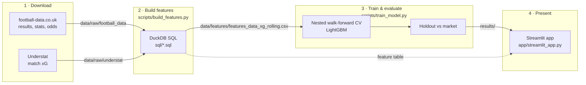
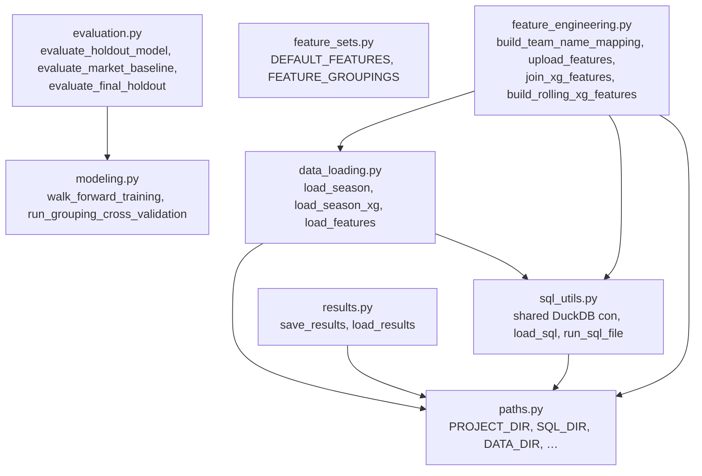
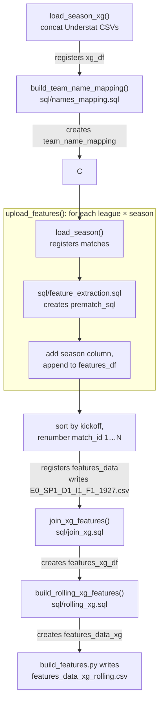
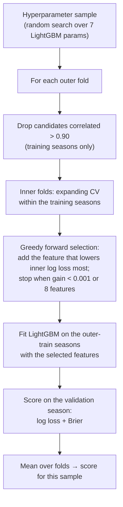
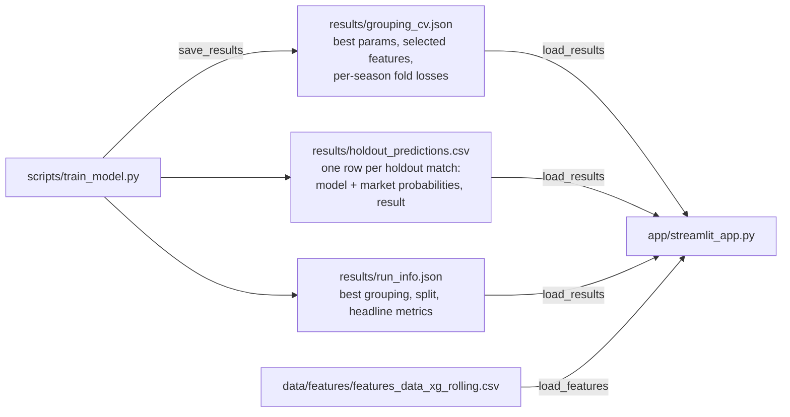

# Architecture

This document explains how footy-prediction is put together: where the data comes from, how
features are built, how the model is trained and evaluated, and how the results reach the app.
For setup and usage, see the [README](../README.md).

## Contents

1. [The big picture](#1-the-big-picture)
2. [Repository layout](#2-repository-layout)
3. [Raw data](#3-raw-data)
4. [Feature pipeline (DuckDB SQL)](#4-feature-pipeline-duckdb-sql)
5. [The model-ready table](#5-the-model-ready-table)
6. [Model training: nested walk-forward CV](#6-model-training-nested-walk-forward-cv)
7. [Evaluation](#7-evaluation)
8. [Results and the Streamlit app](#8-results-and-the-streamlit-app)
9. [Scripts, notebooks and tests](#9-scripts-notebooks-and-tests)
10. [Design decisions](#10-design-decisions)
11. [Known limitations](#11-known-limitations)
12. [How to extend it](#12-how-to-extend-it)

---

## 1. The big picture

The project is a pipeline with four stages. Each stage writes files that the next one reads, so
any stage can be rerun on its own.



| Stage | Entry point | Reads | Writes |
|---|---|---|---|
| Download | `scripts/download_football_data.sh` | football-data.co.uk | `data/raw/football_data/<league>/<season>.csv` |
| Build features | `scripts/build_features.py` | `data/raw/**` | `data/features/*.csv`, `data/raw/understat/xg_*.csv` |
| Train & evaluate | `scripts/train_model.py` | `data/features/features_data_xg_rolling.csv` | `results/*` |
| Present | `streamlit run app/streamlit_app.py` | `data/features/…`, `results/*` | nothing |

All reusable logic lives in the **`footy_prediction` package** (`src/footy_prediction/`). The
scripts, notebooks and app are thin layers that call it.

## 2. Repository layout

```text
footy-prediction/
├── src/footy_prediction/      # the package: all reusable logic
├── sql/                       # the feature SQL, kept as separate .sql files
├── scripts/                   # command-line entry points for each stage
├── app/streamlit_app.py       # the results app
├── notebooks/                 # exploration notebooks that import the package
├── data/raw/                  # downloaded inputs
├── data/features/             # generated feature tables
├── results/                   # saved training outputs (read by the app)
├── tests/                     # pytest suite
├── docs/                      # this document and README images
├── scraper_fbref/             # standalone FBref scraper (not used by the pipeline)
└── scrap/                     # archived experiments (not used)
```

### Package modules and how they depend on each other



| Module | Responsibility |
|---|---|
| `paths.py` | Resolves every directory from the package's own location (`Path(__file__).parents[2]`), so code works from any working directory. |
| `sql_utils.py` | Holds the **single shared DuckDB connection** `con`, plus `load_sql()` / `run_sql_file()` for reading and running files in `sql/`. |
| `data_loading.py` | Reads raw CSVs into pandas and **registers them as DuckDB tables** (`matches`, `xg_df`). `load_features()` reads a saved feature table and makes the team, referee and league columns categorical. |
| `feature_engineering.py` | Runs the SQL steps in order and stacks the per-season results into one table. |
| `feature_sets.py` | The candidate feature lists that get compared. |
| `modeling.py` | Nested walk-forward cross-validation with hyperparameter search and forward feature selection. |
| `evaluation.py` | Holdout scoring of the model and the bookmaker baseline. |
| `results.py` | Writes and reads the files in `results/` that the app presents. |

Importing any module has no side effects beyond opening an in-memory DuckDB connection. No SQL
runs and no model trains on import.

## 3. Raw data

| Source | Location | Contents | Key columns |
|---|---|---|---|
| [football-data.co.uk](https://www.football-data.co.uk) | `data/raw/football_data/<league>/<season>.csv` | One row per match: result, match stats, bookmaker odds | `Div, Date, Time, HomeTeam, AwayTeam, FTHG, FTAG, FTR, HS, AS, HST, AST, HF, AF, HC, AC, HY, AY, HR, AR, Referee, AvgH, AvgD, AvgA` |
| Understat | `data/raw/understat/<prefix>/<prefix>_<season>.csv` | One row per match with expected goals | `date, home_team, away_team, home_team_code, away_team_code, home_xg, away_xg` |

- **Leagues:** `E0` Premier League, `SP1` La Liga, `D1` Bundesliga, `I1` Serie A, `F1` Ligue 1.
  The Understat folders use the prefixes `eng, esp, ger, ita, fra`.
- **Seasons** are four-digit codes: `1920` = 2019/20, up to `2627` = 2026/27 (in progress).
- **`FTR`** (full-time result: `H`/`D`/`A`) is the prediction target.
- **Encoding quirk:** 16 of the 40 football-data files start with a UTF-8 byte-order mark, which
  turns the first header into `Div`. `load_season()` strips it, so every season has a clean
  `Div` column.

## 4. Feature pipeline (DuckDB SQL)

`scripts/build_features.py` runs five steps on the **shared DuckDB connection**. A table
registered or created by one step is visible to the next, which is why the order matters.



### Step by step

**1. `load_season_xg(league_codes, seasons)`** concatenates the Understat files, writes the
combined `data/raw/understat/xg_<leagues>_<seasons>.csv` and registers it as `xg_df`.

**2. `names_mapping.sql`** creates `team_name_mapping` (`team_name → team_code`). The two sources
spell teams differently ("Man United" vs "Manchester United"), so the table maps both spellings
to Understat's three-letter code. The table is seeded from `xg_df`, then football-data spellings
are added by hand.

**3. `feature_extraction.sql`**, once per league-season, reading the `matches` table:

| Temp table | What it does |
|---|---|
| `matches_data` | Parses `kickoff` from `Date` + `Time`; numbers matches within the season; looks up both team codes; builds `match_concat` = `date_home_away` (the xG join key); converts average odds to implied probabilities `1/odds`, then removes the bookmaker margin by dividing by their sum (`market_*_prob_fair`, which sum to 1). |
| `history` | Unpivots each match into **two team rows** (home perspective and away perspective) with goals for/against, points (3/1/0), shots, shots on target, fouls, corners and cards. |
| `history_features` | Rolling means per `(league, team)` over the previous 5 and 10 matches, plus rest days since the previous match. |
| `venue_history_features` | The same rolling means per `(league, team, venue)`: home-only form and away-only form. |
| `prematch_sql` | Joins the home and away team rows back onto each match, giving `home_*`, `away_*`, `home_*_home_*`, `away_*_away_*` and difference features such as `points_difference_last_5`. |

**4. `join_xg.sql`** builds the same `date_home_away` key on `xg_df` and **inner-joins** match xG
onto the features, giving `features_xg_df`. Matches without an xG match are dropped.

**5. `rolling_xg.sql`** computes each team's rolling xG *created* and xG *conceded* over its
previous 5 matches, and selects the final, **model-ready column set** as `features_data_xg`.

### Leakage safety: the most important property

Every rolling window is defined as

```sql
ROWS BETWEEN 5 PRECEDING AND 1 PRECEDING   -- ordered by kickoff, match_id
```

The window **ends one match before** the current one, the SQL equivalent of pandas
`.shift(1).rolling(5)`. A match's own result, goals, shots or xG therefore never feed into its own
features. The consequence is that a team's first match in the data has no history, so its rolling
features are `NULL`.

```text
Team's matches (by kickoff):   m1   m2   m3   m4   m5   m6   m7
Features for m7 use:                ├─── m2 … m6 ───┤         ← m7 itself excluded
```

`tests/test_package.py::test_feature_extraction_sql_uses_only_previous_matches` checks this on
synthetic data.

Two related details:

- **Windows are partitioned by `league` and `team`.** `feature_extraction.sql` runs one
  league-season at a time, so points, goals, shots and venue form **reset at the start of each
  season**. `rolling_xg.sql` runs on the stacked table of all seasons, so **rolling xG carries
  over** from the previous season.
- **Bookmaker odds are pre-match**, so they're legitimate features. Post-match columns (`HS`,
  `AS`, `FTHG` …) are used only *inside* the rolling history of earlier matches, never as
  features of the current match.

### Global match ordering

After stacking all league-seasons, `upload_features` **sorts by `kickoff` and renumbers `match_id`
from 1**. So `match_id` is chronological across all leagues, and the modelling code relies on
this (holdout = last 20% by `match_id`). A `season` column (`"2019/20"` …) is added at the same
point for season-based cross-validation.

## 5. The model-ready table

`data/features/features_data_xg_rolling.csv` has one row per match, about 12,650 rows:

| Group | Columns |
|---|---|
| Identifiers | `match_id` (chronological), `kickoff`, `season`, `Div`, `HomeTeam`, `AwayTeam`, `Referee` |
| Target | `FTR` (`H` / `D` / `A`) |
| Market (benchmark only, never a model input) | `market_home_prob_fair`, `market_draw_prob_fair`, `market_away_prob_fair` |
| Results form | `home/away_points_last_5`, `home/away_goals_for_last_5`, `home/away_goals_against_last_5` |
| Venue form | `home_points_home_last_5`, `away_points_away_last_5` |
| Form differences | `goals_difference_last_5`, `points_difference_last_5`, `rest_days_diff` |
| Shots | `home/away_shots_on_target_for_last_5` |
| Style | `home_fouls_for_last_5`, `away_fouls_for_last_5`, `home_corners_for_last_5`, `away_corners_for_last_5` |
| xG | `home/away_xg_last_5` (created), `home/away_xg_against_last_5` (conceded) |

`load_features()` turns `HomeTeam`, `AwayTeam`, `Referee` and `Div` into pandas categoricals,
which LightGBM then treats as categorical features.

The candidate models are defined in `feature_sets.FEATURE_GROUPINGS`. They use **football
information only**: the bookmaker probabilities are kept out of every grouping so they can serve
as an independent benchmark. `Referee` is excluded because it's only recorded for the Premier
League.

| Grouping | Question it answers | Features |
|---|---|---|
| `team_identity` | How much do long-run team strengths explain? | `HomeTeam`, `AwayTeam`, `Div` |
| `results_form` | Does recent results form predict the next match? | points, goals for/against (last 5), venue points |
| `xg_form` | Is chance quality (xG) more predictive than results? | xG created/conceded, shots on target (last 5) |
| `results_plus_xg` | Do results and xG complement each other? | points/goals differences, venue points, xG created/conceded |
| `teams_plus_form` | Team identity plus form and fatigue | teams, league, xG created/conceded, points difference, rest days |

## 6. Model training: nested walk-forward CV

Football data is a time series, so ordinary shuffled k-fold would train on the future. Instead,
`modeling.walk_forward_training` uses **expanding-window cross-validation by season**, with
feature selection nested inside each training window.

### Outer loop: which seasons validate what

The last season is held out entirely. Each outer fold trains on **at least two** earlier seasons,
so the nested feature selection always has an inner fold.

```text
Seasons:        19/20  20/21  21/22  22/23  23/24  24/25  25/26 | 26/27
Outer fold 1:   train  train  VALID                             | held out
Outer fold 2:   train  train  train  VALID                      | held out
Outer fold 3:   train  train  train  train  VALID               | held out
Outer fold 4:   train  train  train  train  train  VALID        | held out
Outer fold 5:   train  train  train  train  train  train  VALID | held out
```

### Inside each outer fold



- **Search space** (random sample of `n_iter` combinations; `run_grouping_cross_validation` uses
  20): `num_leaves ∈ {7,15,31}`, `max_depth ∈ {3,4,6}`, `learning_rate ∈ {0.01,0.03,0.05}`,
  `min_child_samples ∈ {20,30,50}`, `subsample`, `colsample_bytree ∈ {0.7,0.8,1.0}`,
  `reg_lambda ∈ {0,1,5}`. Fixed settings: `objective="multiclass"`, `n_estimators=150`,
  `random_state=42`.
- **Baseline for selection:** with no features selected, the "model" predicts the training
  seasons' class frequencies. A feature is only added if it beats that. If none does, the fold
  falls back to those frequencies.
- **Output:** a DataFrame with one row per hyperparameter sample, sorted by `mean_log_loss`, with
  per-fold losses, the validation seasons and the last fold's selected features.

`run_grouping_cross_validation` runs this for every grouping. For each one it keeps the best row,
the LightGBM hyperparameters (`best_params`), the `selected_features`, and the per-season fold
losses.

**Cost:** about 25 s per hyperparameter sample, so 20 samples × 4 groupings take roughly
35 minutes.

## 7. Evaluation

### Holdout (`evaluation.evaluate_holdout_model`)

1. Sort by `match_id` (chronological) and drop rows missing any required feature.
2. Train on the first 80% of matches and test on the last 20%, currently about Feb 2025 to Sep 2026
   across all five leagues.
3. Fit LightGBM with the best grouping's selected features and hyperparameters.
4. Return log loss, Brier score, the fitted model and **per-match probabilities**.

### The bookmaker baseline

The fair market probabilities are a strong benchmark: they already contain everything public
about both teams. The app scores the model and the market on **exactly the same holdout
matches**.

| Metric | Formula | Meaning |
|---|---|---|
| Log loss | mean of `−log p(actual result)` | Punishes confident wrong predictions hardest. **The main metric; lower is better.** |
| Brier score | mean of `Σ (p_k − y_k)²` over H/D/A | Squared error of the probability vector; lower is better. |
| Accuracy | share of matches where the most likely outcome happened | Easy to read, but ignores how confident a prediction was. |

### Untouched final season (`evaluation.evaluate_final_holdout`)

This alternative trains on every season before the last and tests on the final season only,
which CV never saw. It's the cleanest out-of-sample test, but the current final season is still
in progress and small.

## 8. Results and the Streamlit app



The app **never trains a model**. It reads saved results, so it starts in seconds and works
straight after cloning the repo. Structure:

- **Filter row** (leagues, season range) at the top, scoping every tab.
- **Overview:** outcome shares by league, matches per season (from the feature table).
- **Model comparison:** CV log loss per grouping (dot plot), per-season fold losses, best
  hyperparameters, and a note on how many matches each grouping was scored on.
- **Model vs market:** headline metric deltas, calibration curves per outcome, cumulative
  log-loss advantage over time, per-league comparison. Everything is computed on the fly from
  `holdout_predictions.csv`, so the filters apply.
- **Match explorer:** a table of holdout matches; select a row to compare the model's and the
  market's probabilities.
- **Team form:** a team's rolling xG and pre-match win probability over time.

Every chart has a **Table** tab with the same numbers. Colours come from a colour-blind-safe
palette with separate light and dark variants, chosen from the viewer's theme. Data loading is
wrapped in `st.cache_data`. `FOOTY_RESULTS_DIR` points the app at a different results folder.

## 9. Scripts, notebooks and tests

| Path | Role |
|---|---|
| `scripts/download_football_data.sh START END [LEAGUES…]` | Downloads raw football-data CSVs (end year exclusive). |
| `scripts/build_features.py` | Runs the full SQL pipeline and writes the feature tables. |
| `scripts/train_model.py` | Grouping CV → holdout evaluation → market baseline → `results/`. |
| `notebooks/dataloader.ipynb` | Calls the download script. |
| `notebooks/datacleaner.ipynb` | Runs the pipeline step by step, with sanity checks (a manual validation of one match's rolling features). |
| `notebooks/lightgbm.ipynb` | Interactive version of the training script. |
| `tests/test_package.py` | Imports, SQL paths from any working directory, **leakage check**, BOM handling, chronological `match_id`, CV on synthetic seasons, results round-trip. Run with `python -m pytest`. |

The notebooks contain no function definitions; each function has one canonical implementation
in the package.

## 10. Design decisions

| Decision | Why |
|---|---|
| **SQL for features, Python for modelling** | Window functions state "previous N matches for this team" exactly and readably, and DuckDB runs them in-process over pandas DataFrames. |
| **One shared DuckDB connection** | The SQL steps are chained through named tables (`xg_df` → `team_name_mapping` → `features_data` → …). Tests pass their own connection to `run_sql_file`. |
| **`src/` layout + editable install** | Imports can't accidentally pick up the working directory, and `paths.py` can find `sql/` and `data/` relative to the source tree. |
| **Season-based walk-forward CV** | Respects time order and matches how the model would be used: trained on past seasons, predicting the next. |
| **Nested feature selection** | Choosing features on the same data used to score them inflates CV scores. Selecting inside the training seasons keeps the validation season unseen. |
| **Log loss as the main metric** | Betting-style use needs well-calibrated probabilities, not only the right favourite. |
| **Market as the benchmark** | "Better than the bookmakers" is the meaningful bar; beating a naive home-win baseline is easy. |
| **Saved results, not live training in the app** | Training takes about 35 minutes; the app must load instantly. |

## 11. Known limitations

- **Referee coverage:** `Referee` is only filled for the Premier League, so it's kept out of the
  groupings (a missing value would drop the whole row). Groupings still see slightly different
  row counts, because early-season matches lack form history; the app shows **matches_used**.
- **Holdout vs CV overlap:** the 80/20 holdout starts partway through 2024/25, but 2024/25 and
  2025/26 are also CV validation seasons used to choose hyperparameters and the grouping, so
  holdout scores may be slightly optimistic. `evaluate_final_holdout` avoids this.
- **Form resets each season:** the `feature_extraction.sql` windows restart every season because
  that SQL runs per league-season, so each team's first matches of a season have missing form
  features and are dropped (rolling xG does carry over).
- **xG join drops a few matches:** matches whose date or team codes don't line up between the
  sources are dropped by the inner join in `join_xg.sql`.
- **Pre-match average odds:** `AvgH/D/A` are averages across bookmakers at data collection time,
  not closing odds, so the market benchmark could be slightly stronger with closing prices
  (`AvgCH/D/A`).

## 12. How to extend it

**Add a league:** add its code to `download_football_data.sh`, add the Understat prefix to
`league_prefixes` in `load_season_xg`, add any new team spellings to `names_mapping.sql`, then add
the code to `LEAGUE_CODES` in `build_features.py` and to `LEAGUE_NAMES` in the app.

**Add a feature:**

1. Compute it in `sql/feature_extraction.sql` (per team in `history`, rolled in
   `history_features` with a `… PRECEDING AND 1 PRECEDING` window) or in `rolling_xg.sql`.
2. Select it into the final table in `rolling_xg.sql`.
3. Add it to a grouping in `feature_sets.py`.
4. Rerun `build_features.py`, then `train_model.py`, and check with `pytest` that the leakage
   test still passes.

**Try a new feature grouping:** add an entry to `FEATURE_GROUPINGS`, then rerun `train_model.py`.
The app picks it up automatically.
