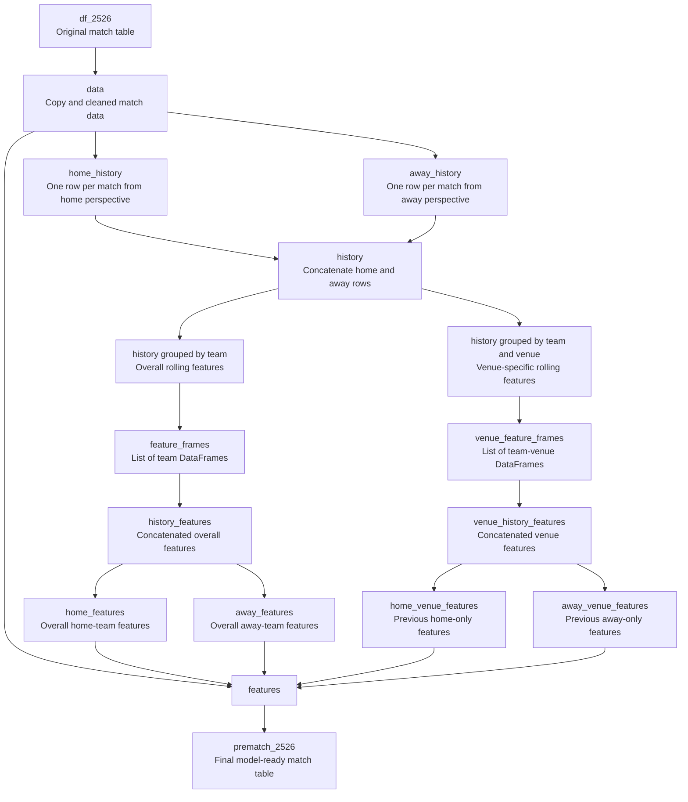

```mermaid
flowchart TD
    A[df_2526<br/>Original match table] --> B[data<br/>Copy and cleaned match data]

    B --> C[home_history<br/>One row per match from home perspective]
    B --> D[away_history<br/>One row per match from away perspective]

    C --> E[history<br/>Concatenate home and away rows]
    D --> E

    E --> F[history grouped by team<br/>Overall rolling features]
    F --> G[feature_frames<br/>List of team DataFrames]
    G --> H[history_features<br/>Concatenated overall features]

    E --> I[history grouped by team and venue<br/>Venue-specific rolling features]
    I --> J[venue_feature_frames<br/>List of team-venue DataFrames]
    J --> K[venue_history_features<br/>Concatenated venue features]

    H --> L[home_features<br/>Overall home-team features]
    H --> M[away_features<br/>Overall away-team features]

    K --> N[home_venue_features<br/>Previous home-only features]
    K --> O[away_venue_features<br/>Previous away-only features]

    B --> P[features]
    L --> P
    M --> P
    N --> P
    O --> P

    P --> Q[prematch_2526<br/>Final model-ready match table]
    
```